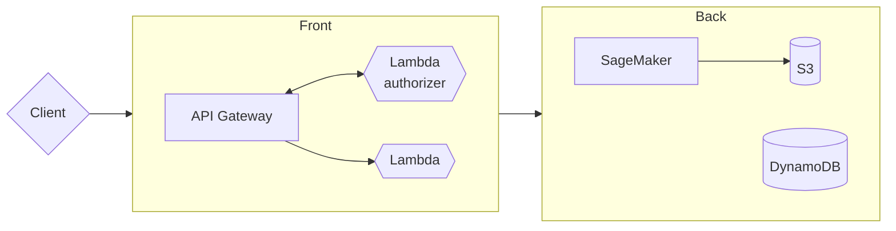
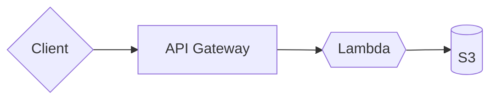

# Diamond Price Prediction for the Public - AWS
> [!WARNING]\
> This file makes use of the [mermaid](https://mermaid.js.org/) declarative syntax for diagram definition. Render it directly on GitHub, install the [VSCode extension](https://marketplace.visualstudio.com/items?itemName=bierner.markdown-mermaid), or paste the diagram code on [mermaid's live editor](https://mermaid.live/).

We propose a system design based on Amazon Web Services to scale and deploy the diamond price prediction model to the public.

The system shall expose a public REST API, providing certain functionalities:

1. User/client authorization
2. Request model predictions (real time and batched)
3. Fit new models with custom data and/or hyperparameters
4. Upload new data (see point 3.)

The toy REST API provided with this project (See ``diamond.web`` module) showcases a proof of concept for points 2, 3 and 4.

The general proposed structure of the system is the following:

Overall, the system is designed as a full serverless infrastructure. The serverless paradigms of AWS are extremely popular and encouraged for machine learning solutions thanks to their cost efficiency and near-seamless scalability.

Let us detail the different components of the system.

## Endpoints
API endpoints are provided by the common pair of services: *API Gateway* and *Lambda functions*. Lambda functions have limited resources and computational time per job, hence they only represent the entry point for an internal infrastructure of specialized services. A single lambda can handle all the endpoints of the system, or multiple lambdas can be used for finer granularity. For the task at hand, we consider keeping a single function.

## Authentication and authorization
Naturally, it desirable to keep track of who uses the system, who is authorized and who is not, since authentication is at the basis of pricing mechanisms.

*API Gateway* provides the possibility to define a preliminary lambda function that handles authentication. This mechanism is called *Lambda authorizer*. The actual implementation of the authorizer is completely arbitrary. In our case, user details and pricing information are stored in a NoSQL DB, provided by the *DynamoDB* service.

## Model training and inference
Model training and inference is handled by the *SageMaker* service, which is designed to operate with popular ML frameworks, such as `scikit-learn`. *SageMaker* wraps a user defined executable script to train the model, feeding it with data (eventually) downloaded from *S3*. Finally, the serialized model can be uploded to *S3*. The process to deploy and predict using the model is similarly streamlined.

Endpoints defined within `diamond.web` (`PUT /models/{model_id}`) showcase how an arbitrary user could train a new model using server-side datasets, allocating it as a new resource in the system. In our new design, this endpoint would store new models in *S3* buckets, where they can later be retrieved for inference.

Like most AWS, *SageMaker* provides great flexibility, making it possible to choose machine region and machine types for both training and inference. This flexibility can eventually be used to provide region specific setups (definining per-region S3 buckets as well) and/or to define different pricing schemes for the end user.

## Upload new data
Simiarly to how model training is handled, the `diamond.web` API involves dataset management endpoints (`PUT/POST /datasets/{dataset_id}`). In this way, a user (or Don Francesco's team) can update or upload new datasets, which is endemic to custom model training, described above.
In our new design, data can be stored on S3, without passing through *SageMaker*.

*(authentication is excluded from the graph for simplicity)*

In the case of exceptionally large files S3 provides partial upload utilities, which are well aligned with the REST schema of `diamond.web`.
